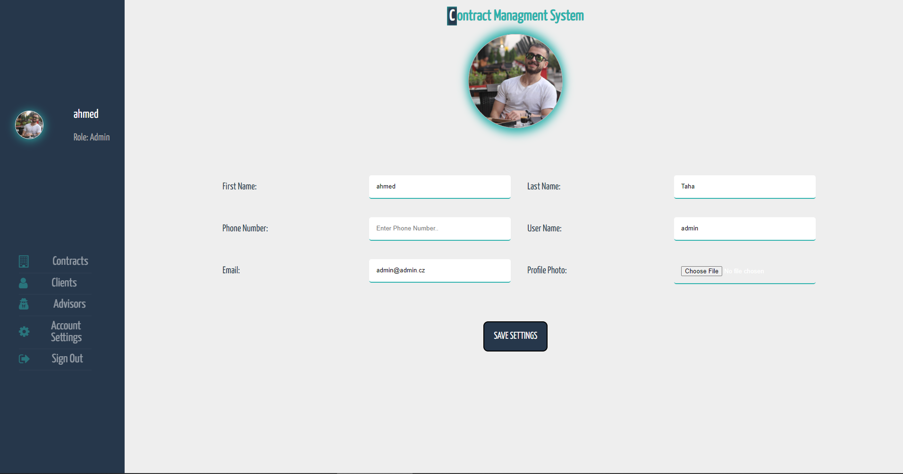

Contract Managment System Full Stack ASP.NET MVC application.
=======
  
Introduction:
------
Welcome to Contract Mangment System application, it is a full stack ASP.NET Core MVC (.NET6) application

App and Team Inforamtion:
------
`App Name:` Contract Managment System. 
`Created By:` Ahmed Al-Doori. 
`App For:` Blogic Company as Interview Task 
`Front-End Techs:` HTML5, CSS3, JavaScript, RazorCode, Jquery, CSS Media Quries for Responsive Design, BodymovinLibary for Lottie Animation  
`Back-End Techs:` ASP.NET Core, MS SQL Server, ClosedXML Library for Exporting Sheets 

What you will be able to do as Website owner:
--------
The system will allow you to do the following:
 - Browsering the Contracts from your database, with full joined details with the advisors and client
 - Admin Role
 - Login page 
 - Signout functionallity
 - Change admin settings [Name, PhoneNumber ...etc]
 - Protected Routing
 - Browsering all the clients from your database 
 - Browsering all the advisors from your database 
 - Search for contracts by insituit name 
 - Search for clients by client name. Filtering clients by [Age, Name, Surname] 
 - Search for advisors by advisor name. Filtering clients by [Age, Name, Surname] 
 - [Future feature] Admin can (add, delete, create) (Contracts, Advisors, Clients)
 - Export (Contracts, Advisors, Clients) as Excel Sheet or CSV
 
 App Internal Features:
 --------
 - ASP.NET Core Identitfication and authentication
 - Cookies managment
 - different roles 
 - seprated bussiness logic 
 - Responsive Design (Mobile Friendly Desing) 
 - Splash Screen 
 - Server Side Validation 
 - [Future feature]- Client Side Validation using JavaScript
 
 Software || Hardware Requirements:
 -----------
 - Internet Connection is Required
 - IDE that is able to run .net and C# projects
 - Your own database Connection string 
 - .net sdk and run time (.NET6)
 - .net tools for using terminal and ef
 - when using .NET CLI or CMD for commands follow (https://docs.microsoft.com/en-us/ef/core/cli/dotnet)
 
 Setup Instructions:
 ------------
 (Prefered IDE: Visual Studio Community) 
 <strong>1-</strong> Download the GitRepo as Zip or Pull it to your local repo 
 <strong>2-</strong> Open the .NET Solution file (example.sln) 
 <strong>3-</strong> in appSettings.json, add your own connection string to your database 
 <strong>4-</strong> in case you are using [Visual Studio Community] open Package Manager console and add first Migration:   
 `Add-Migration "0.0.1-FirstAppMigration"` 
 <strong>5-</strong> in case your are using VS Code or another IDE you can use Terminal or CMD inside the solution path and add: 
`dotnet ef migrations add InitialCreate` 
 <strong>6-</strong> in case you are using [Visual Studio Community] open Package Manager console again and update database using following code :   
 `Update-Database` 
 <strong>7-</strong> in case your are using VS Code or another IDE again you can use Terminal or CMD inside the solution path and add: 
`dotnet ef database update` 
 <strong>8-</strong> To Login as Admin use the (Username: admin, Password: admin) 
 <strong>9-</strong> Here you go run the application and happy coding :) 

Internal App ScreenShots:
-----------
 **- Splash Screen:**
</img>
 **- Login Page:**
</img>
 **- Account Settings Page:**
</img>
 **- Contracts Page:**
</img>
 **- Clients Page:**
</img>
 **- Advisors Page:**
</img>
 **- Responsive Account Settings:** 
</img> 
 **- Responsive SignIn Page:** 
</img> 
**- Responsive Contracts Page:** 
</img> 
>>>>>>> 122e6cba014d019c1d9aa396efdf5f3e59aee96f
